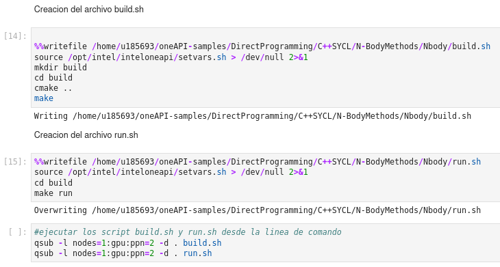
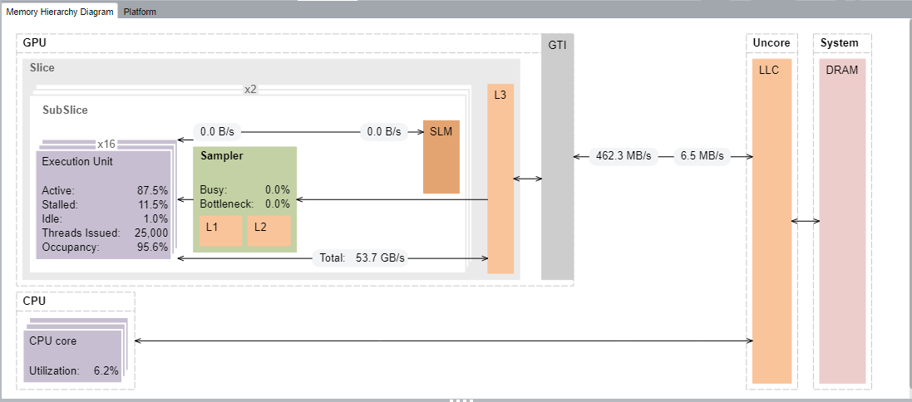

# Datos
APELLIDOS : Zamora Manuelo  
NOMBRES : Fernando Julian

# Respuestas
0. Clonando el repositorio : git clone _https://github.com/oneapi-src/oneAPI-samples.git_
    

1. Escribimos el comando *cd* para cambiar al directorio 
   - **cd** /home/u185693/oneAPI-samples/DirectProgramming/C++SYCL/N-BodyMethods/Nbody
2. El algoritmo nbody trata sobre simular los valores de un conjunto de particulas que tienen(masa,posicion,rapidez,acelaracion) durante un determinado intervalo de tiempo. 
   - El archivo **main.cpp** es el codigo que instancia la clase GSimulation que es un objeto sim con los 4 atributos ya mencionados, ademas la variable *argc* y el puntero doble *argv* permiten cambiar los valores por defecto del numero de particulas y la cantidad de intervalos desde la linea de comandos, sin embargo estos estaran como datos tipo string por lo que hacemos una conversion a entero usando std::atoi, el cambio se realiza a traves del metodo set del constructor. 
   - En el archivo **GSimulation.hpp** se crea la clase GSimulation,los metodos como InitPos(),InitVel(),Start().Los valores iniciales del objeto que forman parte del metodo constructor, los metodos set y get que permiten cambiar los valores de los atributos, el metodo *printheader* muestra los resultados de la simulacion.
3. Accedemos a un nodo de un hardware de gen11 intel con el comando *qsub -I -l nodes=1:gen11:ppn=2 -d .*

   - Para ejecutar el Nbody debemos crear los archivos build.sh y run.sh 
        
        
        - Asimismo para ejecutar la aplicacion debemos asignar nodos que ejecuten los archivos. 
    - Se creara la carpeta build dentro del directorio se encontrará el archivo compilado de nbody, para ejecutar el archivo lo unico que tenemos que hacer es escribir el comando **./nbody** 
    
        - La simulacion se hara con los valores por defecto iniciados en el constructor GSimulation(cambiando los valores 16000 a 80 000 y de 10 intervalos a 20 intervalos), pero se puede modificar al menos los primeros valores desde la linea de comando segun el codigo fuente en el archivo *main.cpp*      
4. Analisis **Hotspots** con vtune
   El grafico indica que se han usado 25000 threads para realizar el job, asi como el ancho de banda del cpu-gpu es 462.3 MB/s sin embargo para regresar los datos del gpu al cpu es 6.5 MB/s lo cual es mucho menor.
    
   En codigo fuente del archivo *GSimulation.cpp* observamos que un **HOSTSPOT** dentro del programa es el metodo parallel_for, el cual consume un tiempo de 10.138 s 
   
5. Analisis **Roofline** con advisor
   En el grafico se pueden observar 2 puntos verdes que indican que es una seccion poco usada que tienen que ver con el limite de memoria y el computo.
    
   En el grafico se observan hotspots que es el metodo Start de la clase GSimulation que es el que lleva el codigo de las operaciones para obtener los valores de la masa, velocidad,aceleracion y posicion de las particulas a traves del tiempo.
   
   En este grafico vemos el costo tiempo que toma buscar el device selector que al parecer es considerable.
   
   
   Segun el offload modelling nos recomienda para optimizar el programa usar dpc++ o OpenMP, también seria mejor en vez de usar el default selector, usar gpu_selector pues aunque en este caso solo tenemos gpu como el device, suele haber otros casos de hay mas de un device y podria generar un error.   
   
